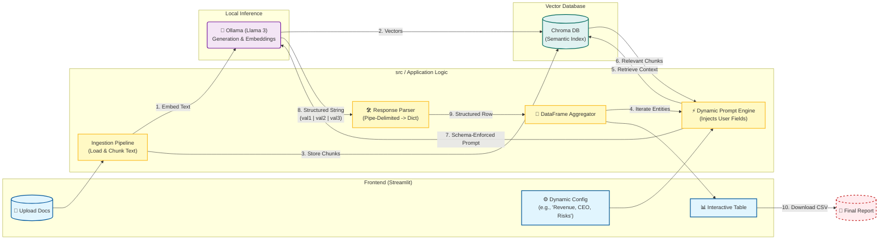

```mermaid
graph LR
%% Styles
classDef ui fill:#e1f5fe,stroke:#01579b,stroke-width:2px;
classDef logic fill:#fff9c4,stroke:#fbc02d,stroke-width:2px;
classDef db fill:#e0f2f1,stroke:#00695c,stroke-width:2px;
classDef ai fill:#f3e5f5,stroke:#7b1fa2,stroke-width:2px;
classDef data fill:#ffebee,stroke:#c62828,stroke-width:2px,stroke-dasharray: 5 5;

    subgraph User_Interface ["Frontend (Streamlit)"]
        UI_Input[("📂 Upload Docs")]:::ui
        UI_Config["⚙️ Dynamic Config<br/>(e.g., 'Revenue, CEO, Risks')"]:::ui
        UI_View["📊 Interactive Table"]:::ui
    end

    subgraph Backend_Logic ["src / Application Logic"]
        direction TB
        Ingest["Ingestion Pipeline<br/>(Load & Chunk Text)"]:::logic
        PromptBuilder["⚡ Dynamic Prompt Engine<br/>(Injects User Fields)"]:::logic
        Parser["🛠️ Response Parser<br/>(Pipe-Delimited -> Dict)"]:::logic
        PandasEngine["🐼 DataFrame Aggregator"]:::logic
    end

    subgraph Storage ["Vector Database"]
        Chroma[("Chroma DB<br/>(Semantic Index)")]:::db
    end

    subgraph AI_Runtime ["Local Inference"]
        Ollama("🦙 Ollama (Llama 3)<br/>Generation & Embeddings"):::ai
    end

    %% Data Flow Connections
    UI_Input --> Ingest
    Ingest -- "1. Embed Text" --> Ollama
    Ollama -- "2. Vectors" --> Chroma
    Ingest -- "3. Store Chunks" --> Chroma

    UI_Config --> PromptBuilder

    %% The Analysis Loop
    PandasEngine -- "4. Iterate Entities" --> PromptBuilder
    PromptBuilder -- "5. Retrieve Context" --> Chroma
    Chroma -- "6. Relevant Chunks" --> PromptBuilder

    PromptBuilder -- "7. Schema-Enforced Prompt" --> Ollama
    Ollama -- "8. Structured String<br/>(val1 | val2 | val3)" --> Parser

    Parser -- "9. Structured Row" --> PandasEngine
    PandasEngine --> UI_View
    UI_View -- "10. Download CSV" --> Output[("📄 Final Report")]:::data
```
